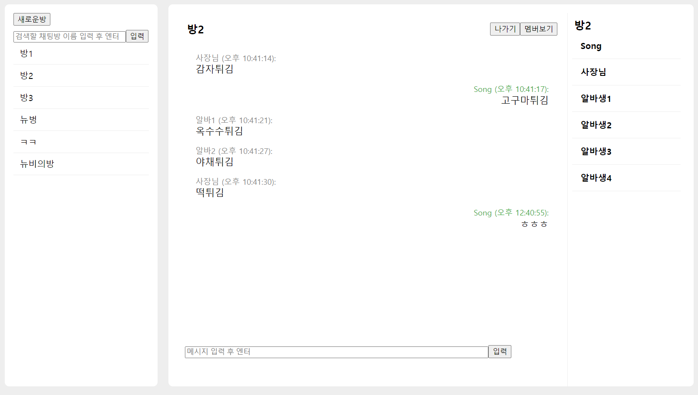

# react-chat-app

* react, typesript chat-app


## 실행 방법

```
1. npm install
2. npm run start
```


## 폴더구조

```
src
├─components
│  ├─members
│  ├─messages
│  ├─rooms
│  └─share
│      └─input
├─types
└─utils
```


## 타입검사

```
npx tsc --watch ./App.tsx --jsx react-jsx --esModuleInterop
```


## 사용 라이브러리

```
json-server
axios
```


## 참고

### json-server 설치

``` 
npm install json-server
```


## 화면

