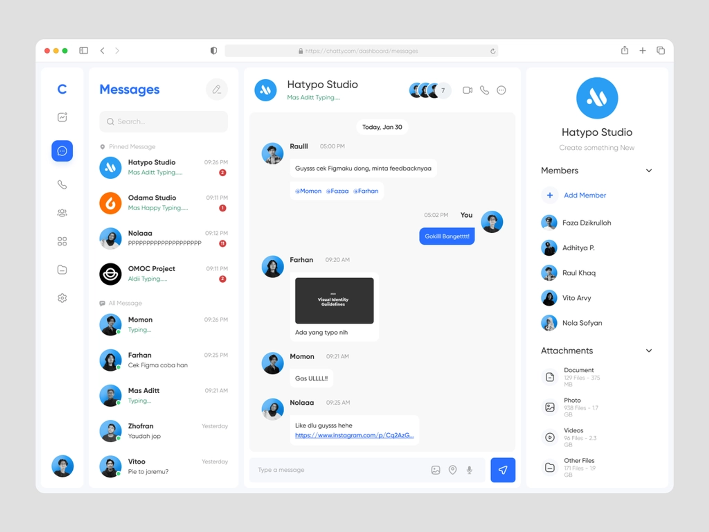

# React, Typescript 과제

다음과 같은 `채팅앱 UI`를 구현해 주세요

### 프로젝트

-   `React` 와 `Typescript` 를 사용하여 구현합니다
-   프로젝트 설정이 어려울 수 있으니 create-react-app 타입스크립트 템플릿을 사용해 주세요
    -   https://create-react-app.dev/docs/adding-typescript/
-   상태 관리 라이브러리를 써도 되고 안 써도 됩니다

### 요구사항

-   다음 예시 그림처럼 UI를 똑같이 구현할 필요는 없습니다. 기능만 구현하면 되기 때문에 텍스트 위주로 UI를 구성해 주세요
-   UI만 구현하기 때문에 데이터는 더미 데이터를 넣어서 구현해 주세요
-   아래 요구사항에 있지 않은 기능은 구현할 필요 없습니다
-   화면은 세 개의 단으로 구성됩니다
    -   가장 왼쪽에 채팅방 목록
    -   중간에 선택한 채팅방
    -   오른쪽에 선택된 채팅방의 멤버
-   채팅방 목록
    -   참여한 채팅방 목록이 나옵니다
    -   채팅방을 새로 만들 수 있습니다
        -   채팅방 이름만 입력하면 채팅방을 만들 수 있습니다
-   채팅방
    -   왼쪽의 채팅방 목록에서 선택된 채팅방이 나옵니다
    -   채팅을 할 수 있습니다
    -   사용자, 채팅내용, 시간이 출력됩니다
    -   채팅방을 나갈 수 있고 채팅방을 나가면 채팅방 목록에서 삭제됩니다
    -   멤버보기를 누르면 멤버 목록 화면이 나옵니다
-   멤버 목록
    -   현 채팅방에 참여한 멤버의 목록이 나옵니다

https://www.notion.so/React-Typescript-c8911c84700543beba484f5e8f1b9d3f

npm install -g json-server
npm install -g json-server
